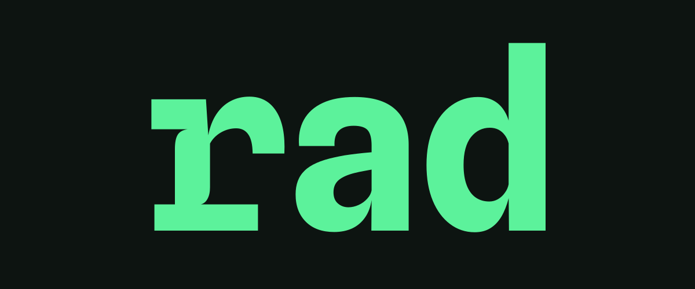

# Rad

Rad is a new relational database built around developer experience and a single cohesive toolchain.

## The Goal

The goal of this project is not to immediately ship a fully working database you can deploy now. It's more to explore this idea, which seems to have only been poked at in research papers.

I want people to critique this, play with it, build a dumb project, but most of all think about the ideas behind it, share notes and discuss! I'd love to talk to you!

## What's different

Rad is _quite_ different to your average relational database.

Firstly, it doesn't use SQL as its primary interface. Instead, it defines an intermediate representation designed to be written by machines, not humans. This means that Rad is optimised for ORM-like tooling rather than hand-written, string gluing queries in a DSL. Because of this, Rad's query planner and optimiser is constructed around a relational node graph. While it makes use of many traditional relational query planner techniques to optimise ordering, access paths and physical plan construction, it does not leak as much of this back to consumers and does not force users to "trick" the planner into choosing specific paths.

On top of re-thinking the OLTP interface into a more modern approach built around end to end type safety, Rad also takes a different approach to persistence. There is no on-disk format, instead Rad uses SlateDB in order to be backed by object storage. This, while not as fast as writing page files to an NVME drive, offers cheap and durable storage while allowing the Rad query engine to be run "serverless" (or, in less buzzwordy terms, on ephemral/stateless computers that do not need persistent disks.)

This is currently a research project, however I am no academic so instead of writing a paper about my ideas, I decided to just build them. "Shut up and show me the code" or something?

Anyway, that hopefully makes it clear that Rad is NOT production ready, it has no API stability guarantees and has not been run with production workloads.

## Testing

That being said, Rad takes a lot of inspiration from world class databases for its approach to testing. There is a full reference interpreter based oracle tester with random generative test suites that produce thousands of IR trees and runs them against three planners: the real planner-optimiser, a full-scan only planner and a dumb reference interpreter.

On top of that there are metamorphic tests that mutate IR trees in strange ways and test-shrinking, which search for errors and generate new data-defined regression tests.

## The workflow

Databases usually give you a place to store data, a way to query it (almost always SQL) and call it a day.

Rad wants to give you the whole stack. Instead of a database by one team, a migration tool by another and a codegen tool by [some dude in nebraska](https://xkcd.com/2347/), Rad ships all of that together as one cohesive stack built against one vision for how it should be done. Kinda like how Go shipped you a compiler, a linter, a test framework and a package manager (ok, a few years later, but point remains) built by one team with one vision for what works best for everyone.

The vision for the developer experience is your schema is in charge. You author it and from it you get:

- strongly typed database clients that generate optimised queries (there's no DSL to glue and get wrong, it just writes the logical "plan" directly)
- migrations as a first class citizen, built into the database itself, not as a hacky tool on top
- a pretty decent relational model that does 80% of the CRUD work you often find in the average webapp: joins, CTEs, the usual stuff. You won't find graph-y traversals, vectors, pubsub or any other features that probably warrant just using the right tool for the job. Rad just does relational, hopefully does it well, and not much else.

```text
rad.schema.yaml → rad schema migrate → generated application client
```

## Disclaimer

I've used databases for 20 years but I've never built one. First time for everything! But this project will be nowhere near the GOATs like Postgres, SQLite, etc. those are built by seriously smart people.

But maybe you're seriously smart and this project seems interesting 👀

## AI usage transparency

AI coding tools have been used quite a bit to produce the prototype, build the shrinker tests and differential tests. Quite a lot of the query planner logic was also done using AI. Some of the early PIR/LIR semantics were designed using ChatGPT as a idea-bouncing tool. The very first POC was fully "vibecoded" but it sucked so I deleted it and started again by hand...

Models/tools used: Claude & Codex, Fable/Opus, GPT-Sol.

## Try the demo

The demo is a small team task tracker using the generated Go client. It runs
the complete schema-migrate, client-generate, HTTP, planner, executor, and
storage path, then leaves Rad serving at `localhost:7237`.

```sh
task up
```

## Basic workflow

Initialize a project interactively, or add `--yes` to accept the defaults:

```sh
rad init
```

This gets you started with the right files, as well as a simple template schema.

```text
rad.schema.yaml   your declarative Rad database schema definition
rad.config.yaml   project configuration, including the target database URL
rad.state/        accepted state created by schema migrate or schema pull
```

The generated `rad.config.yaml` targets a local Rad server and configures a Go
client by default:

```yaml
database_url: rad://127.0.0.1:7237
generate:
  - language: go
    output: generated
    package: db
```

Then start a server:

```sh
rad serve --catalog-mode schema
```

Catalog mode schema means you can only modify the database schema by running migrations. You can omit this in order to more freely create/edit/delete tables and columns.

The public API listens on `http://localhost:7237`. The same process serves the built-in administration UI on `http://localhost:7238`. You can use the admin UI to explore, if you aren't using Schema mode, you can create, edit and delete tables or columns from this UI.

Preview and apply a schema to the running server:

```sh
rad schema diff
rad schema migrate
rad schema status
```

Migration writes the accepted schema to `rad.state/` and regenerates configured
clients by default. `rad schema pull` recovers an accepted schema from a server
that is ahead of the local project. The generated client is tied to that exact
accepted schema version and hash and refuses to run against a different server
schema. Application code should not edit `rad.state/`.

## AI agents

Rad ships an [Agent Skills](https://agentskills.io)-compatible guide that
always matches the installed CLI. Start an agent session with:

```sh
rad skills get rad
```

Use `rad skills get rad --full` for the bundled schema, operations, and Go
client references. `rad --help` links to the relevant product documentation,
and finite commands support `--output json`. Add `--non-interactive` in
unattended work so Rad fails instead of prompting for input or destructive
consent.

The small discovery skill in `skills/rad/` can be installed into compatible
coding agents with:

```sh
npx skills add Southclaws/rad --skill rad
```

The discovery skill redirects the agent to the version-matched instructions
embedded in the `rad` binary.

## Development

Useful cross-platform project commands are defined in
[`Taskfile.yml`](Taskfile.yml):

```sh
task test
task build
```

The admin application's compiled assets are checked in so building Rad does
not require Node. After changing files under `admin/src`, regenerate those
assets with `task generate:admin` before rebuilding the binary.
